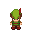

# 프로젝트명: Wanna Go Home

# [ 목차 ]

### 1. [게임명: Wanna Go Home](#name)
### 2. [컨셉](#생존)
### 3. [관련 이미지와 동영상](#3)
### 4. [대표 이미지](#4)
### 5. [컨셉과 대표이미지 기반 작품 묘사](#5)
### 6. [WannaGoHome 구성 요소](#6)
### 7. [게임 시스템 디자인](#7)
 + a.[게임 오브젝트 분해](#7.1)
 + b.[파라미터 뽑아보기](#7.2)
 + c.[행동 뽑아보기](#7.3)
 + d.[상태 뽑아보기](#7.4)
 + e.[플레이어 캐릭터 속성](#7.5)
 + f.[게임의 규칙](#7.6)
 + g.[게임에서 사용될 공식](#7.7)

### 8. [개발 요구사항 & 흐름도](#8)
 + a.[WannaGoHome의 요구사항](#8.1)
 + b.[시간별 흐름도 flowchart](#8.2)
 + c.[키보드 이벤트에 대한 흐름도](#8.3)

### 9. [개발작업 일정(6달)](#9) 
# [게임명: Wanna Go Home] 

# [컨셉] 

## 메인컨셉 : 생존

- 빠른 성장이 목표가 아닌 천천히 주변을 둘러보며 성장해 나가는 RPG방식

### 서브 컨셉 1 : 우주

- 사람들의 일상이 담긴 게임은 우리에게 조금 더 와닿을 것이라고 생각합니다.

### 서브 컨셉 2 : 탐험

- 일상도 좋지만 가끔씩 일상에서 벗어나는 일탈을 하는 것도 좋다고 생각합니다.

### 서브 컨셉 3 : 컨트롤

- 게임에 소소한 행운 요소는 필수라고 생각합니다.

### 서브 컨셉 4 : 성장

- 목표가 없는 RPG는 언젠가 지치기 마련입니다. 성장을 할수록 많은 어드벤티지를 누릴수 있습니다.

### 서브 컨셉 5 : 다양함

- 끊임없이 즐길 수 있는 콘텐츠를 만들면, 플레이어는 다음에 뭐하지라는 부푼 마음을 갖고 게임에 임하게 됩니다.

  

# [관련 이미지 & 동영상] 

- 이미지  
  
- 동영상
  

  

# [대표 이미지] 

  

# [컨셉 & 대표이미지 기반 작품묘사] 

> ### 대표이미지 기반 : 
> - 맵은 일정 픽셀 단위로 나누어 제작 할 예정입니다. 
> - 이동 및 각종 동작들은 키보드로 진행됩니다. 
> - 플레이어는 각 용도에 맞는 칸에 들어가 일정한 키를 누르면 ( ex: 농사칸 스페이스바 ) 그에 맞는 행동을 합니다.

> ### 컨셉 기반: 
> - 힐링: 플레이어는 맵을 돌아다니며 여러가지 행동을 자유롭게 즐길 수 있습니다.
> - 일상: 주변에 흔히 접할 수 있는 농사, 낚시, 채집등 여러가지가 첨부돼 있습니다.
> - 모험: 사냥을 통해 여러가지 재료를 수집 및 성장을 합니다.
> - 성장: 캐릭터 성장을 통해 더 넓은 세계를 탐험할 수 있습니다.
> - 다양함: 다양한 종류의 씨앗, 어류, 과일 등 다양한 물품을 수집해 컬렉션을 채우는 즐거움이 있습니다. 

  

# [어드벤쳐 월드 구성 요소] 

- 끝없이 펼쳐지는 세계속에서 살아 남으며, 끝없이 탐험해라!

 

## 1. 메커니즘

[도전 과제]

1. 지속적으로 떨어지는 포만감으로 인해 생존하기 위해서는 식량이 필요합니다.
2. 더 넓은 세계를 구경하기 위해서는 사냥을 통해 캐릭터의 성장이 필요합니다.
3. 여러가지 아이템들을 조합하여 생존에 도움을 줘야 합니다.

[재미 요소]

1. 다양한 방식으로 식량, 생존을 할 수 있어 선택의 즐거움이 있습니다.
2. 캐릭터의 성장으로 더 넓은 세상을 볼 수 있습니다.
3. 컬렉션 및 업적을 진행하여, 성취욕을 높히게 됩니다.

 

## 2. 이야기

[만들게 된 배경]  
게임을 플레이 할 때 부담 없이 즐길 수 있는 힐링 게임을 생각하던 중 모두의 동물의 숲이 생각
났습니다. 하지만 모두의 동물의 숲을 제작하기에는 살짝 밋밋하다고 느껴져, 생존을 결합해보자라는 생각이
들었습니다. 이렇게 생각하던 중 그와 비슷한 게임인 굶지마 투게더(관련 동영상)이 생각이 났으며, 각자 게임의
장점을 모아 만들어보자 라는 생각을 갖고 기획하게 됐습니다.

[카메라 관점]  
미니게임과 같은 특수한 경우를 제외한 경우 카메라는 다음과 같습니다.
=> 플레이어가 화면 일정부분 이상을 움직이게 될 경우 카메라가 플레이어를 따라 이동하게 됩니다.

 

## 3. 미적요소

[디자인][컬러]  
- 게임이 심플한 방식으로 3D가 아닌 2D로 진행되며, 그에 따라 심플한 캐릭터, 배경을 넣을 예정입니다.

[음향]  
- 게임이 시간 흐름에 따라 낮과 밤이 구분됩니다.  시간에 맞춘 음악을 넣을 예정입니다.
- 플레이어는 여러가지 동작을 진행하게 됩니다. 동작에 알맞은 효과음을 넣을 예정입니다.
- 전투가 진행될 때 플레이어의 체력이 일정 수준 이하로 내려갈 경우 급박한 효과음을 넣을 예정입니다.

 

## 4. 기술

- Unity를 이용하여 PC게임으로 제작할 예정입니다. 

# [게임 시스템 디자인] 

## 1. 게임 오브젝트 분해 (구성 요소 분석) 

|연번|오브젝트 이름|오브젝트 이미지|
|:----:|:----:|:----:|
|1|동식||
|2|고블린||
|3|포탈||
|4|맵||

## 2. 파라미터 뽑아 보기 
### 1. 동식

|속성|영문명칭|설명|
|:----:|:----:|:----:|
|체력|HP|플레이어의 체력을 나타낸다. 잔여 체력이 없으면 플레이어는 사망하게 된다|
|포만감|Satiety|플레이어의 포만감을 나타낸다. 시간이 지날수록 포만감은 계속 떨어진다|
|레벨|Level|플레이어의 레벨을 뜻한다. 플레이어의 경험치가 일정 이상으로 쌓게 되면 올라간다.|
|공격력|Power|플레이어의 공격력을 뜻한다. 레벨 및 도구에 따라 상승하고 하락한다.|
|기술 등급|Technical Level|플레이어의 특수 행동(농사, 채집 등)의 레벨을 뜻한다.|

### 2. 고블린

|속성|영문명칭|설명|
|:----:|:----:|:----:|
|레벨|Level|고블린의 레벨을 뜻한다.|
|공격력|Power|고블린의 공격력을 나타낸다. 레벨에 따라 달라진다.|
|이동속도|Speed|고블린의 이동속도를 나타낸다. 레벨에 따라 달라진다.|

### 3. 포탈

|속성|영문명칭|설명|
|:----:|:----:|:----:|
|위치|Place|포탈의 이동 위치를 나타낸다.|
|이름|Name|포탈 이름을 나타낸다. 이름에 따라 색이 변경된다.|

### 4. 자연

|속성|영문명칭|설명|
|:----:|:----:|:----:|
|강|River|맵에 있는 강을 뜻하며, 낚시를 할 수 있다.|
|물고기|Fish|강에 있는 물고기를 뜻하며, 낚시를 통해 얻을 수 있다.|
|나무|Tree|맵에 있는 나무를 뜻하며, 채집을 할 수 있다.|
|과일|Fruit|나무에 있는 열매를 뜻하며, 채집을 통해 얻을 수 있다.|
|수풀|Bush|맵에 있는 수풀을 뜻하며, 뒤져보면 씨앗을 얻을 수 있다.|
|씨앗|Seed|농사에 쓰이는 씨앗이다. 시간이 지나면 잡곡으로 변한다.|
|동물|Animal|맵에 있는 동물을 뜻한다.|

## 3. 행동 뽑아 보기 

### 1. 동식

|행동|설명|
|:----:|:----:|
|이동|플레이어가 맵을 돌아다닌다|
|낚시|강가에 앉아 낚시를 한다|
|농사|농사를 짓는다|
|채집|수풀, 나무에 다가가 채집을 한다|
|공격|칼을 휘둘러 공격한다|
|제작|아이템을 사용해 새로운 아이템을 만든다|

### 2. 고블린

|행동|설명|
|:----:|:----:|
|패트롤|일정 시간이 지날 때마다 주위를 돌아다닌다|
|추격 및 공격|플레이어가 범위 내로 들어올 시 공격을 한다|
|사냥|해가 떨어지면 플레이어를 찾아 다닌다|

## 4. 상태 뽑아 보기 

### 1. 동식

|현상태|전이상태|전이조건|
|:----:|:----:|:----:|
|대기|낚시|강가 근처에서 스페이스 버튼을 입력|
|대기|농사|농사가 가능한 구역에서 스페이스 버튼을 입력|
|대기|채집|나무 및 수풀 근처에서 스페이스 버튼을 입력|
|대기|공격|컨트롤 버튼을 입력|
|대기|이동|상하좌우 버튼을 입력|
|대기|제작|인벤토리에 제작 버튼을 클릭|
|대기|피격|적에게 공격받음|

### 2. 고블린

|현상태|전이상태|전이조건|
|:----:|:----:|:----:|
|대기|추격|플레이어가 일정 범위 내로 들어옴|
|피격|사망|hp가 0 이하로 떨어짐|
|대기|패트롤|일정 시간이 지남|
|대기|사냥|해가 떨어지며, 저녁 시간대가 됨|

### 3. 자연

|현상태|전이상태|전이조건|
|:----:|:----:|:----:|
|채집 가능|채집 불가|플레이어가 채집을 함|
|채집 불가|채집 가능|채집 불가 상태에서 일정 시간이 지남|
|수확 불가|수확 가능|씨앗을 심은 후 일정 시간이 지남|

## 5. 플레이어 캐릭터 속성 

|속성|영문명칭|설명|
|:----:|:----:|:----:|
|체력|HP|플레이어의 체력을 나타낸다. 잔여 체력이 없으면 플레이어는 사망하게 된다|
|포만감|Satiety|플레이어의 포만감을 나타낸다. 시간이 지날수록 포만감은 계속 떨어진다|
|레벨|Level|플레이어의 레벨을 뜻한다. 플레이어의 경험치가 일정 이상으로 쌓게 되면 올라간다.|
|공격력|Power|플레이어의 공격력을 뜻한다. 레벨 및 도구에 따라 상승하고 하락한다.|
|기술 등급|Technical Level|플레이어의 특수 행동(농사, 채집 등)의 레벨을 뜻한다.|

## 6. 게임의 규칙 

### 1. 핵심 규칙

- 플레이어의 Hp 및 포만감이 0이 될 시 게임에서 패배한다.
- 포만감은 음식 섭취로만 올릴 수 있다.
- 플레이어가 작업(ex: 농사, 사냥, 낚시)을 하기 위한 장비는 있다고 가정한다.
- 플레이어가 일정 Level에 도달하면 다른 세계로 갈 수 있는 포탈이 열린다.
- 낮과 밤이 있으며, 밤에는 안전지대가 아닌 이상 끊임없는 공격이 온다.
- 게임 시작 시 플레이어에게 불을 지급하며, 불로 안전지대를 설정할 수 있다..
- 기술 등급이 있으며, 등급이 올라갈수록 작업에 높은 효율을 가져다준다.

### 2. 보조 규칙

- 플레이어의 포만감은 꾸준히 떨어진다.
- 플레이어는 음식을 사냥, 낚시등 여러 가지 방법으로 획득할 수 있다.
- 플레이어의 공격력은 Level 및 장비에 비례해 올라간다.
- 불은 제작을 통해 얻을 수 있으며, 새로운 장소에 설치 시 기존에 설치된 안전지대는 사라진다.
- 기술 등급은 반복된 작업으로 올릴 수 있다.
- 플레이어 Hp는 표시되지 않으며, UI 이펙트로 예상을 해야 한다.
- 플레이어 Hp는 자연 회복 또는 포션을 마셔 회복할 수 있다.
- 낮과 밤을 제외한 중간 시간은 없다.

## 7. 게임에서 사용될 공식 

### n = 현재 l = 레벨
 
- 포만감: 6초마다 n – 1
- 밤낮을 구분하는 시간: 8분 간격
- 공격력: n+(l*0.2)

# [개발 요구사항 & 흐름도] 

## 1. 어드벤쳐 월드의 요구사항 

## [요구사항 6주]

### 시작 화면 - A

1. ~~시작화면에 새로하기, 이어하기 버튼이 있다.~~
2. ~~새로하기 클릭시 잔여 데이터는 사라지며, 게임화면으로 가게 된다.~~

### 게임 UI 및 시스템 -B

1. ~~게임화면 우측 상단에는 포만도, 인벤토리 버튼, 레벨이 표시된다.~~
2. ~~게임화면 좌측 상단에는 환경설정 버튼이 있다.~~
3. ~~환경설정 내에는 사운드 조절 및 종료가 있다~~
4. ~~플레이어에게는 hp 및 포만감이 있다.~~
5. ~~플레이어의 포만감은 시간에 따라 감소하며, 식량 섭취시 증가한다.~~
6. ~~맵에는 몬스터가 있으며, 공격으로 처치할 수 있다.~~
7. ~~몬스터 처치시 플레이어 경험치가 증가하며, 경험치에 따라 레벨이 증가한다.~~
8. ~~플레이어가 몬스터에게 피격시 hp가 감소한다.~~
9. ~~플레이어 hp가 일정 이하로 떨어지게 되면 게임은 패배하며, 세이브 유무와 상관없이 데이터는 사라진다.~~
10. ~~플레이어의 소실된 hp는 시간에 따라 증가한다.~~
11. ~~맵에는 조건 블록이 있으며(ex 낚시, 농사), 특수행동 버튼 클릭시 그에 맞추어 행동한다.~~
12. ~~플레이어가 일정 레벨을 넘어갈시 던전을 향 포탈이 생기게 된다.~~

### 특수행동 - C

#### (아이템 미선택시)
1. ~~수확 - 농사가 완료된 근처에서 특수행동 버튼 클릭시 채집을 하게 된다 (보상: 쌀, 밀, 실패)~~
2. ~~강가 근처에서 특수행동 버튼 클릭시 낚시를 하게 된다.  
 (낚시 낚시중이라는 표시와 대기시간이 나타나며, 대기시간이 끝나면 무엇을 획득했는지 표시 해준다 (보상: 물고기, 새우, 실패))~~

#### (아이템 선택시)
3. ~~씨앗 - 농사가 가능한 구역에서 특수행동 버튼 클릭시 농사를 짓게 된다.~~
 ~~(농사 - 아래 씨앗을 뿌린다. 씨앗은 시간이 지남에 따라 스스로 성장함)~~
4. ~~음식류 섭취를해 포만감이 증가한다.~~

### 조작 및 카메라 - D
1. 이동 - →←↑↓ 
2. 인벤토리 - i 
3. 아이템 선택 - 1~9
4. 특수행동 - 스페이스 
5. 공격 - 컨트롤
6. 플레이어 이동에 맞추어 카메라가 움직인다.

### 몬스터 - E
1. ~~몬스터는 레벨에 따라 공격력 및 hp가 달라진다.~~
2. ~~몬스터는 일정 시간마다 리스폰 된다.~~

## [요구사항 1년]

### 시작 화면

- 이어하기 클릭시 저장된 데이터를 사용하여 게임화면으로 가게 된다.
- 환경설정 내에는 현재 게임 데이터를 저장할 수 있는 저장하기 버튼이 있다.

### 게임 UI 및 시스템

- 게임화면 가운데 하단에는 아이템 퀵슬롯이 버튼이 있다.
- 게임에는 낮과 밤이 존재한다.
- 던전 클리어시 다음 세계로(레벨) 가는 문이 열리게 된다.
- 게임 내부에는 업적 및 컬렉션이 있으며, 특수행동 또는 사냥등으로 얻을 수 있다.
- 플레이어가 몬스터에게 피격 시 잔여 hp에 따라 조절되는 붉은 UI이펙트가 나타난다.
- 맵에는 동물들이 있으며 공격으로 처치할 수 있다.

### 특수행동
#### (아이템 미선택시)
- 나무, 수풀 근처에서 특수행동 버튼 클릭시 채집을 하게 된다.
- (채집 - 채집중이라는 표시와 대기시간이 나타나며, 대기시간이 끝나면 무엇을 획득했는지 표시 해준다. (보상: 나무 - 나뭇가지, 과일, 실패 / 수풀 - 씨앗, 덩쿨, 실패))
- 횃불 - 동그란 원이 그려지며 원 안으로 안전구역을 설정한다.
- 약재류 - hp회복을 한다.

### 몬스터
- 몬스터는 플레이어가 횃불로 설정한 안전구역 내로 들어오지 못한다.
- 플레이어가 몬스터 일정범위 내로 들어올 시 플레이어를 추격한다.
- 밤이 되면 플레이어를 찾아 달려온다.

## 2. 시간별 흐름도 flowchart 

## 3. 키보드 이벤트에 대한 흐름도 

# [개발작업 일정(6주)] 

## [1주]

### 작업명: 맵 제작

### 요구사항
- 맵에는 조건 블록이 있으며(ex 낚시, 농사), 특수행동 버튼 클릭시 그에 맞추어 행동한다.
- 이동 - →←↑↓

### 작업내용
- 타일에 속성값을 넣어주어 플레이어가 해당 타일을 인식할 수 있는 연결고리 제작
- 상하좌우 버튼으로 플레이어 이동을 관리하는 스크립트 생성

## [2주]

### 작업명: 맵 제작 & GUI & 낚시

### 요구사항
- 플레이어에게는 hp 및 포만감이 있다.
- 강가 근처에서 특수행동 버튼 클릭시 낚시를 하게 된다.
- 게임화면 우측 상단에는 포만도, 인벤토리 버튼, 레벨이 표시된다.
- 게임화면 좌측 상단에는 환경설정 버튼이 있다.
- 환경설정 내에는 사운드 조절, 저장 및 종료가 있다.

### 작업 내용
- 강가, 농사가 가능한 구역을 포함한 맵을 제작
- 플레이어를 생성해 Lv,hp, 포만감을 생성 및 관리하는 스크립트 생성
- 포만도, 인벤토리, 레벨 UI를 생성 및 스크립트와 연동
- 환경설정 UI를 생성 후 사운드 조절, 게임 종료버튼 제작
- 낚시라는 행동을 제작해 플레이어가 강가에서 특수행동 버튼을 클릭해 행동

## [3주]

### 작업명: 단축키 & 농사

### 요구사항
- 플레이어의 포만감은 시간에 따라 감소하며, 식량 섭취시 증가한다.
- 농사가 완료된 근처에서 특수행동 버튼 클릭시 채집을 하게 된다 (보상: 쌀, 밀, 실패)
- 농사가 가능한 구역에서 특수행동 버튼 클릭시 농사를 짓게 된다.  (농사 - 아래 씨앗을 뿌린다. 씨앗은 시간이 지남에 따라 스스로 성장함)
- 음식류 - 섭취해 포만감이 증가한다

### 작업내용
- 플레이어에게 빈손, 씨앗, 식량을 지급 및 특정키로 설정한 것을 가정하여 사용할 수 있도록 설정
- 플레이어 포만감을 시간마다 감소하도록 설정
- 식량 선택 후 특수행동 버튼 클릭 시 식량 섭취를 통해 포만감 증가하도록 설정
- 농사가 가능한 구역에서 씨앗을 선택해 특수행동 버튼 클릭 시 씨를 뿌리도록 설정
- 씨는 일정 시간이 지나면 스스로 2단계에 걸쳐 성장해 채집이 가능하도록 설정

## [4주]

### 작업명: 적 제작

### 요구사항
- 해당 요구사항플레이어가 몬스터에게 피격시 hp가 감소한다.
- 플레이어 hp가 일정 이하로 떨어지게 되면 게임은 패배하며, 세이브 유무와 상관없이 데이터는 사라진다.
- 플레이어의 소실된 hp는 시간에 따라 증가한다.
- 몬스터는 레벨에 따라 공격력 및 hp가 달라진다.

### 작업내용
1. 몬스터 제작
 - 일정시간 마다 (대기 - 이동) 상태를 설정 
 - 몬스터에 속성을 부여해 레벨에 따라 달라지게 설정 
 - 피격시 플레이어를 쫓아가 공격을 하도록 설정 (추후 길찾기 알고리즘을 넣을 예정)
2. 플레이어 HP증가 및 데스 트리거 설정 

## [5주]

### 작업명: 플레이어 공격 및 시작화면 제작

### 요구사항
- 시작화면에 새로하기, 이어하기 버튼이 있다.
- 새로하기 클릭시 잔여 데이터는 사라지며, 게임화면으로 가게 된다.
- 맵에는 몬스 있으며, 공격으로 처치할 수 있다.
- 몬스터 처치시 플레이어 경험치가 증가하며, 경험치에 따라 레벨이 증가한다.

### 작업내용
- 시작화면 제작 (시작화면 이어하기 버튼은 비활성화)
- 플레이어 공격 구현
- 몬스터 사망 구현 및 그에 따른 플레이어 경험치 지급

## [6주]

### 작업명: 마무리 작업

### 요구사항: 
- 플레이어 hp가 일정 이하로 떨어지게 되면 게임은 패배하며, 세이브 유무와 상관없이 데이터는 사라진다.
- 몬스터는 일정 시간마다 리스폰 된다
- 플레이어가 일정 레벨을 넘어갈시 던전을 향 포탈이 생기게 된다.

### 작업내용
- 플레이어 데스 트리거 설정
- 플레이어 이동 및 공격 애니메이션 작업
- 몬스터 스폰 장치 생성
- 각종 스테이터스 조정
- 각종 버그제거
- 플레이어가 특정 레벨 달성시 다음 세계로 가는 포탈 생성
